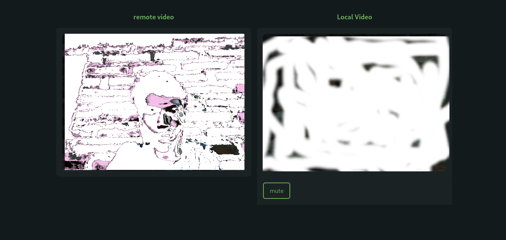

<p align="center"> </p>
<p align="center"><b>media stream via webrtc</b></p>

## how to run in local

- install the dependencies

```
git clone https://github.com/nekonako/moemeet
cd moemeet/futa
npm install
cd ../mashu
npm install
```

- run the server
```
cd moemeet/futa
npm run dev
```

- run next js
```
cd moemeet/mashu
npm run dev
```
